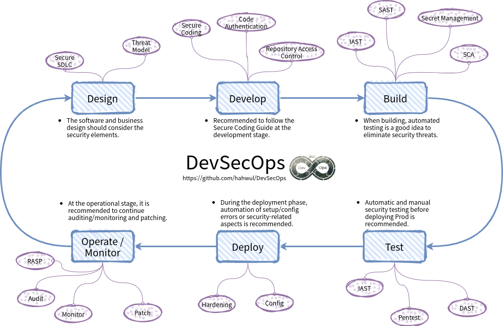
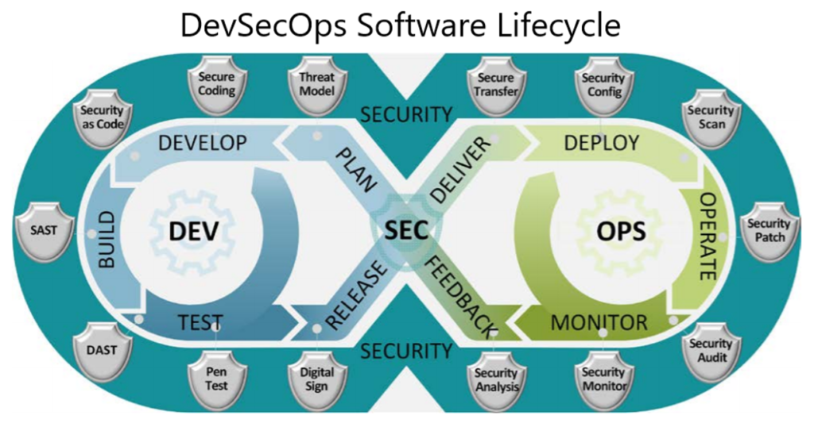
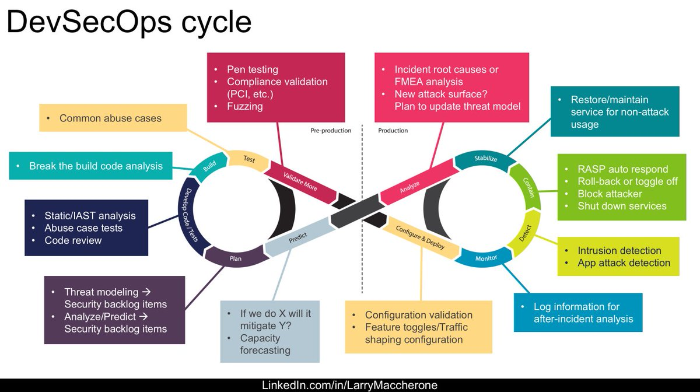
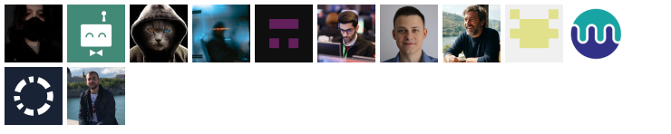

<h1 align="center">
   
  
   
  
  
  
  
  
  
</h1>

  <a href="./README.md">English</a> •
  <a href="./README.ko.md">한국어</a> •
  <a href="./README.jp.md">日本語</a>

> Roadmap for everyone who wants DevSecOps.

## What is DevSecOps and Why is it Important?
DevSecOps is a culture and practice that aims to integrate security into every phase of the software development lifecycle (SDLC).
It emphasizes collaboration between Development, Security, and Operations teams.
The goal is to build secure software from the ground up, reduce vulnerabilities, and ensure faster, safer deployments.
This roadmap provides a curated list of resources and tools to help individuals and organizations implement DevSecOps practices.

## 📜 Table of Contents
- [Roadmap](#-roadmap)
- [Tools](#-tools)
- [Resources](#resources)
  * [0. DevSecOps Overview](#0-devsecops-overview)
  * [1. Design](#1-design)
  * [2. Develop](#2-develop)
  * [3. Build](#3-build)
  * [4. Test](#4-test)
  * [5. Deploy](#5-deploy)
  * [6. Operate and Monitor](#6-operate-and-monitor)
- [Security of CICD](#security-of-cicd)
- [Awesome resources](#awesome-resources)
- [Other roadmaps](#-other-roadmaps)
- [Wrap Up](#-wrap-up)
- [Contributors](#contributors)
- [Contribute](https://github.com/hahwul/DevSecOps/blob/main/CONTRIBUTING.md)

## 📖 How to Use This Roadmap
This roadmap is designed to be a comprehensive guide for individuals and organizations looking to adopt or improve their DevSecOps practices. Here's how you can make the most of it:

1.  **Understand the Basics:** If you're new to DevSecOps, start with the "What is DevSecOps and Why is it Important?" section to get a foundational understanding.
2.  **View the Big Picture:** The main **Roadmap** image provides a visual overview of the different stages and areas within DevSecOps. Use this to orient yourself.
3.  **Explore Tools:** The **Tools** section offers a curated list of software and services that can help you implement various DevSecOps capabilities.
4.  **Dive into Resources:** The **Resources** section is categorized by the DevSecOps lifecycle (Design, Develop, Build, Test, Deploy, Operate and Monitor). Each category contains links to articles, guides, and official documentation. You can explore these based on your specific needs or areas of interest.
5.  **Focus on CI/CD Security:** If your focus is on securing your pipelines, the **Security of CICD** section provides targeted resources.
6.  **Contribute:** This is a community-driven effort. If you have suggestions, find broken links, or want to add new resources, please see our [CONTRIBUTING.md](CONTRIBUTING.md) guide.

You don't have to go through it linearly. Feel free to jump to the sections that are most relevant to your current challenges or learning goals.

## 💭 Roadmap

## 🔩 Tools 
This project includes a curated list of tools to help you implement DevSecOps practices. These tools cover various stages of the SDLC, including Static Application Security Testing (SAST), Dynamic Application Security Testing (DAST), secret management, threat modeling, component analysis, and more.

➡️ [**Explore the DevSecOps Tools List**](./tools/README.md)

This list is designed to help you quickly find and compare tools, reducing the time spent on searching and decision-making.

## 📦 Resources
### 0. DevSecOps Overview
  - Overview
    1. [DevSecOps in Wikipedia](https://en.wikipedia.org/wiki/DevOps#DevSecOps,_Shifting_Security_Left)
    2. [Zero to DevSecOps (OWASP Meetup)](https://owasp.org/www-chapter-belgium/assets/2019/2019-02-20/Zero-to-DevSecOps-OWASP-Meetup-02-19-19.pdf)
    3. [DevSecOps What Why And How (BlackHat USA-19)](https://i.blackhat.com/USA-19/Thursday/us-19-Shrivastava-DevSecOps-What-Why-And-How.pdf)
    4. [DevSecOps – Security and Test Automation (Mitre)](https://www.mitre.org/sites/default/files/publications/pr-19-0769-devsecops_security_test_automation-briefing.pdf)
    5. [DevSecOps: Making Security Central To Your DevOps Pipeline](https://spacelift.io/blog/what-is-devsecops)
    6. [Strengthen and Scale security using DevSecOps](https://owasp.org/www-pdf-archive/Devsecops-owasp-indonesia.pdf)
    7. [DSOVS (OWASP DevSecOps Verification Standard)](https://owasp.org/www-project-devsecops-verification-standard/)
    8. [What is DevSecOps? (Github)](https://github.com/resources/articles/devops/devsecops)
### 1. Design
  - Development Lifecycle
    1. [SDL(Secure Development Lifecycle) by Microsoft](https://www.microsoft.com/en-us/securityengineering/sdl/practices)
    2. [OWASP's Software Assurance Maturity Model](https://github.com/OWASP/samm)
    3. [Building Security In Maturity Model (BSIMM)](https://www.bsimm.com/framework.html)
    4. [NIST's Secure Software Development Framework](https://csrc.nist.gov/CSRC/media/Publications/white-paper/2019/06/07/mitigating-risk-of-software-vulnerabilities-with-ssdf/draft/documents/ssdf-for-mitigating-risk-of-software-vulns-draft.pdf)
    5. [DevSecOps basics: 9 tips for shifting left (Gitlab)](https://about.gitlab.com/blog/2020/06/23/efficient-devsecops-nine-tips-shift-left/)
    6. [6 Ways to bring security to the speed of DevOps (Gitlab)](https://about.gitlab.com/blog/2019/10/31/speed-security-devops/)
  - Threat Model
    1. [What is Threat Modeling / Wikipedia](https://en.wikipedia.org/wiki/Threat_model)
    2. [Threat Modeling by OWASP](https://owasp.org/www-community/Threat_Modeling)
    3. [Application Threat Modeling by OWASP](https://owasp.org/www-community/Application_Threat_Modeling)
    4. [Agile Threat Modeling Toolkit](https://threagile.io)
    5. [OWASP Threat Dragon](https://threatdragon.github.io)
### 2. Develop
  - Secure Coding
    1. [Secure coding guide by Apple](https://developer.apple.com/library/archive/documentation/Security/Conceptual/SecureCodingGuide/Introduction.html)
    2. [Secure Coding Guidelines for Java SE](https://www.oracle.com/java/technologies/javase/seccodeguide.html)
    3. [Go-SCP / Go programming language secure coding practices guide](https://github.com/OWASP/Go-SCP)
    4. [Android App security best practices by Google](https://developer.android.com/topic/security/best-practices)
    5. [Securing Rails Applications](https://guides.rubyonrails.org/security.html)
### 3. Build  
  - SAST(Static Application Security Testing)
    1. [Scan Source Code using Static Application Security Testing (SAST) with SonarQube, Part 1](https://medium.com/nycdev/scan-your-source-code-for-vulnerabilities-using-static-application-security-testing-sast-with-5f8ee1fdf9aa)
    2. [Announcing third-party code scanning tools: static analysis & developer security training](https://github.blog/2020-10-05-announcing-third-party-code-scanning-tools-static-analysis-and-developer-security-training/)
    3. [SAST levels defined by OWASP](https://github.com/OWASP/www-project-devsecops-verification-standard/blob/main/document/CODE-004-Static-Application-Security-Testing-SAST.md)
### 4. Test
  - DAST(Dynamic Application Security Testing)
    1. [Dynamic Application Security Testing with ZAP and GitHub Actions](https://www.zaproxy.org/blog/2020-05-15-dynamic-application-security-testing-with-zap-and-github-actions/) 
    2. [Dynamic Application Security Testing (DAST) in Gitlab](https://docs.gitlab.com/ee/user/application_security/dast/)
    3. [DAST using projectdiscovery Nuclei (github action)](https://github.com/secopslab/nuclei-action)
    4. [ZAPCon 2021-Democratizing ZAP with test automation and domain specific languages](https://youtu.be/jimW-R6_F4U)
    5. [DAST levels defined by OWASP](https://github.com/OWASP/www-project-devsecops-verification-standard/blob/main/document/TEST-002-Dynamic-Application-Security-Testing-DAST.md)
  - Penetration testing
    1. [Penetration Testing at DevSecOps Speed](https://securityboulevard.com/2019/04/penetration-testing-at-devsecops-speed/)
### 5. Deploy
  - Security Hardening & Config
    1. [CIS Benchmarks](https://www.cisecurity.org/cis-benchmarks/)
    2. [DevSecOps in Kubernetes](https://cloudblogs.microsoft.com/opensource/2019/07/22/devsecops-in-kubernetes/)
  - Security Scanning
    1. [Best practices for scanning images (docker)](https://docs.docker.com/develop/scan-images/)
### 6. Operate and Monitor
  - RASP(Run-time Application Security Protection)
    1. [Runtime Application Self-Protection by rapid7](https://www.rapid7.com/fundamentals/runtime-application-self-protection/)
    2. [Jumpstarting your devsecops - Pipeline with IAST and RASP](https://2018.appsec.eu/presos/DevOps_Jumpstarting-Your-DevSecOps_Jeff-Williams_AppSecEU2018.pdf)
  - Security Audit
  - Security Monitor
    1. IAST(Interactive Application Security Testing)
       - [IAST levels defined by OWASP](https://github.com/OWASP/www-project-devsecops-verification-standard/blob/main/document/TEST-003-Interactive-Application-Security-Testing-IAST.md)
    2. Metrics, Monitoring, Alerting
  - Security Analysis
    1. [Attack Surface Analysis Cheat Sheet by OWASP](https://cheatsheetseries.owasp.org/cheatsheets/Attack_Surface_Analysis_Cheat_Sheet.html)

## Security of CICD
- Github Actions
    1. [Security hardening for GitHub Actions](https://docs.github.com/en/actions/security-guides/security-hardening-for-github-actions)
    2. [Github Actions Security Best Practices](https://engineering.salesforce.com/github-actions-security-best-practices-b8f9df5c75f5)
    3. [GitHub Actions Security Best Practices [cheat sheet included]](https://blog.gitguardian.com/github-actions-security-cheat-sheet/)
- Jenkins
    1. [Securing Jenkins](https://www.jenkins.io/doc/book/security/)
    2. [Securing Jenkins CI Systems by SANS](https://www.sans.org/white-papers/36872/)
    3. [DEPRECATED/chef-jenkins-hardening](https://github.com/dev-sec/chef-jenkins-hardening)

### Awesome Resources
* https://github.com/TaptuIT/awesome-devsecops

## 🚀 Other roadmaps
|  |  |
| ------------------------------------------------------------ | ------------------------------------------------------------ |
|   U.S. Department of Defense           | Larry Maccherone                                       |
|  |  | 
| The DevSecOps Security Checklist | Gitlab security devops diagram | 

## 🙏🏼 Wrap Up
If you think the roadmap can be improved, please do open a PR with any updates and submit any issues. Also, I will continue to improve this, so you might want to star this repository to revisit.

Idea from: [Go Developer Roadmap](https://github.com/Alikhll/golang-developer-roadmap)

## Contributors

